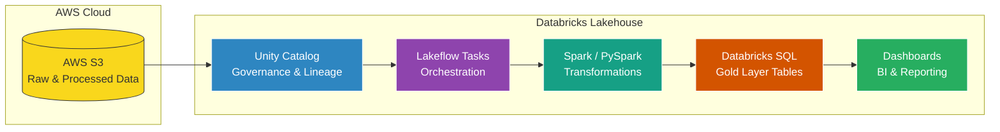

# ApexLabs – NutriWarehouse Analytics Pipeline
## **1. Project Overview**

ApexLabs Nutrition has recently acquired **NutriWarehouse**, a wholesale supplement distributor operating on a different data stack and business model. This project builds a **unified analytics pipeline** that ingests, cleans, standardizes, and transforms NutriWarehouse data into the existing ApexLabs analytics environment.

The entire solution is built using a **Medallion Architecture (Bronze → Silver → Gold)** to ensure modularity, scalability, and data quality. The pipeline provides:

* **Raw data ingestion** from NutriWarehouse (orders, products, customers, inventory exports).
* **Standardization and conformance** with ApexLabs’ data model.
* **Shared dimension tables** (products, dates, customers/accounts, regions).
* **Unified fact tables** (sales, inventory snapshots, shipments).
* **Analytics-ready Gold views** for dashboards and reporting.

By merging NutriWarehouse’s B2B wholesale operations data with ApexLabs’ D2C brand data, the project enables consistent cross-brand reporting, centralized data governance, and improved business decision-making.

The final outcome is a production-ready analytics foundation that allows ApexLabs to analyze:

* Sales and revenue performance across both brands
* Inventory and warehouse operations
* Customer/account behavior
* Product performance and promotional effectiveness


---

# **2. Business Context**

ApexLabs Nutrition operates a direct-to-consumer (D2C) supplement brand, focusing on online sales, customer experience, and subscription-driven revenue. NutriWarehouse, the newly acquired company, operates as a wholesale distributor supplying retail partners and gyms with bulk supplement products.

Because both companies sell similar product lines but operate on different business models (D2C vs. B2B wholesale), their data structures, metrics, and operational workflows are not directly compatible.

The goal of this project is to integrate NutriWarehouse into ApexLabs’ analytics ecosystem by:

* Standardizing the two companies’ data models
* Creating shared dimensions (products, dates, regions, channels)
* Producing unified fact tables for cross-brand reporting

This enables consolidated insights across the ApexLabs group and supports future acquisitions with a repeatable, scalable analytics foundation.


---

# **Technology Stack Overview**

This project uses a modern, scalable **Lakehouse Architecture** built on **AWS + Databricks**.
Below is a visual overview of the core technologies powering ingestion, transformation, governance, and analytics.





# Tech Stack Components**

```
+------------------------+
|   AWS S3               |
|------------------------|
| Raw Data (landing/)    |
| Processed Data         |
| Full Load / Incremental|
+------------------------+
```
```
+--------------------------------+
|     Unity Catalog (UC)         |
|--------------------------------|
| Catalog: fmcg                  |
| Schemas: bronze/silver/gold    |
| Table governance & lineage     |
+--------------------------------+
```
```
customer_dim_processing
    ↓
products_dim_processing
    ↓
prices_dim_processing
    ↓
orders_fact_processing
```
```
+------------------------+
| Apache Spark (PySpark) |
|------------------------|
| ETL / ELT Logic        |
| Silver Transformations |
| Gold Dimensions        |
| Fact Table Aggregation |
+------------------------+
```

```
+-----------------------------+
| Delta Lake Tables           |
|-----------------------------|
| ACID transactions           |
| CDC enabled                |
| Incremental MERGE support  |
| Schema evolution/merge     |
+-----------------------------+
```
```
+-----------------------------+
| Databricks SQL              |
|-----------------------------|
| Gold DIM tables             |
| Gold FACT tables            |
| Views for dashboards        |
+-----------------------------+
```

```
+--------------------------------+
| Databricks Dashboards          |
|--------------------------------|
| Customer Insights              |
| Product Sales                  |
| Gross Price Trends             |
| Order Analytics (Monthly)      |
+--------------------------------+
```


#**3. Repository Structure**

The project follows a clean medallion-oriented layout, with separate areas for setup, data ingestion, dimensional modeling, fact processing, and dashboards.

```text
apexlabs-analytics-pipeline/
│
├── data/
│   ├── ApexLabs/
│   │   ├── Full Load/
│   │   │   ├── customers/
│   │   │   ├── gross price/
│   │   │   ├── orders/
│   │   │   └── products/
│   │   └── Incremental Load/
│   │       └── orders/
│   │           └── <daily order CSVs for December>
│   │
│   ├── NutriHouse/
│   │   ├── Full Load/
│   │   │   ├── customers/
│   │   │   ├── gross price/
│   │   │   ├── orders/
│   │   │   └── products/
│   │   └── Incremental Load/
│   │       └── orders/
│   │           └── <daily order CSVs for December>
│
├── dimensional_data_processing/
│   ├── customer_data_processing.ipynb
│   ├── pricing_data_processing.ipynb
│   └── products_data_processing.ipynb
│
├── fact_data_processing/
│   ├── full_load_fact.ipynb
│   └── incremental_load_fact.ipynb
│
├── scripts/
│   ├── denormalise_table_query_fmcg.sql
│   └── incremental_data_parent_company_query.sql
│
├── setup/
│   ├── catalog_setup.ipynb
│   ├── dim_date_table_creation.ipynb
│   └── utilities.ipynb
│
├── dashboard/
│   └── fmcg_dashboard.pdf
│
└── README.md
```

### **`data/`**

Raw data used for Bronze ingestion.

* **ApexLabs** and **NutriHouse** separated.
* Each has:

  * **Full Load** → customers, products, orders, gross price
  * **Incremental Load** → daily order extracts for December
* Enables simulation of real-world batch + incremental streaming ingestion.


### **`dimensional_data_processing/`**

Scripts that build **Gold-layer dimensions**:

* `customer_data_processing.ipynb`
  Clean + conform customer/account data.
* `pricing_data_processing.ipynb`
  Standardizes gross price structures and pricing attributes.
* `products_data_processing.ipynb`
  Conforms product catalogs from both companies.

These output Gold dimensional tables such as `dim_customer`, `dim_product`, etc.


### **`fact_data_processing/`**

Logic for building **fact tables**:

* `full_load_fact.ipynb`
  Builds fact tables using the complete dataset.
* `incremental_load_fact.ipynb`
  Builds fact tables using daily incremental loads for December.

Outputs include fact tables like:

* `fact_gross_price_apexlabs`
* `fact_gross_price_nutrihouse`
* Unified fact tables (if unioned in Gold)


### **`scripts/`**

Reusable SQL transformation logic:

* `denormalise_table_query_fmcg.sql`
  Used for flattening / denormalizing Silver data.
* `incremental_data_parent_company_query.sql`
  Logic to load incremental orders for ApexLabs.


### **`setup/`**

Environment initialization and core dimensions:

* `catalog_setup.ipynb`
  Creates catalog + medallion schemas (`bronze`, `silver`, `gold`).
* `dim_date_table_creation.ipynb`
  Generates the Gold `dim_date` table.
* `utilities.ipynb`
  Defines schema constants used across notebooks.


### **`dashboard/`**

Visualization outputs and reporting:

* `fmcg_dashboard.pdf`
  A PDF dashboard built from Gold-layer fact + dimension tables.

---

# **4. Setup**

This section describes all the initialization steps required before running the Bronze, Silver, and Gold data pipelines. The setup executes three main tasks:

1. **Create the catalog and medallion schemas**
2. **Initialize helper variables used across notebooks/scripts**
3. **Build the foundational `dim_date` table in the Gold layer**

## **4.1 Catalog & Schema Initialization**

File: `catalog_setup.py` 

This script prepares the Databricks environment by creating a dedicated catalog (`fmcg`) and the three medallion schemas (`bronze`, `silver`, `gold`).

```sql
-- Create catalog if it does not exist
CREATE CATALOG IF NOT EXISTS fmcg;
USE CATALOG fmcg;

-- Create medallion schemas
CREATE SCHEMA IF NOT EXISTS fmcg.gold;
CREATE SCHEMA IF NOT EXISTS fmcg.bronze;
CREATE SCHEMA IF NOT EXISTS fmcg.silver;
```


### **What this achieves**

* Ensures all tables for ApexLabs + NutriWarehouse live under **one governed catalog**.
* Ensures consistent table placement across:

  * `fmcg.bronze.*` (raw ingested data)
  * `fmcg.silver.*` (clean/conformed data)
  * `fmcg.gold.*` (dimensional model / fact tables)

This step **must be run before any other pipeline script**.

## **4.2 Utility Schema Variables**

File: `utilities.py` 

This small utility script exposes standard schema names to ensure consistent usage across notebooks and pipelines:

```python
bronze_schema="bronze"
silver_schema="silver"
gold_schema="gold"
```

These variables are imported by downstream notebooks to avoid hard-coding schema names and to keep schema references centralized.

### **Purpose**

* Prevents accidental schema mismatches.
* Keeps medallion layer references clean and consistent across the repo.
* Makes future changes (e.g., renaming schemas) much easier.

## **4.3 Gold Layer Setup — Date Dimension Creation**

File: `dim_date_table_creation.py` 

This script generates the **Month-Level Date Dimension** used by both ApexLabs and NutriWarehouse fact tables in the Gold layer.

### **Steps performed**

#### **1. Define date boundaries**

```python
start_date = "2024-01-01"
end_date   = "2025-12-01"
```

#### **2. Generate one row per month between start and end dates**

Uses Spark SQL `sequence()` + `explode()` to generate month start dates:

```python
df = spark.sql(f"""
    SELECT explode(
        sequence(
            to_date('{start_date}'),
            to_date('{end_date}'),
            interval 1 month
        )
    ) AS month_start_date
""")
```

#### **3. Add analytics-friendly columns**

* `date_key` (YYYYMM integer)
* `year`
* `month_name` (e.g., “January”)
* `month_short_name` (e.g., “Jan”)
* `quarter` (Q1, Q2, etc.)
* `year_quarter` (e.g., 2024-Q1)

```python
df = (
    df.withColumn("date_key", F.date_format("month_start_date", "yyyyMM").cast("int"))
      .withColumn("year", F.year("month_start_date"))
      .withColumn("month_name", F.date_format("month_start_date", "MMMM"))
      .withColumn("month_short_name", F.date_format("month_start_date", "MMM"))
      .withColumn("quarter", F.concat(F.lit("Q"), F.quarter("month_start_date")))
      .withColumn("year_quarter", F.concat(F.col("year"), F.lit("-Q"), F.quarter("month_start_date")))
)
```

#### **4. Save as a Gold table**

```python
df.write \
    .mode("overwrite") \
    .format("delta") \
    .saveAsTable("fmcg.gold.dim_date")
```

### **Purpose of `dim_date`**

* Acts as a **shared dimension** for both brands
* Enables time-based analysis for Gross Price facts
* Ensures consistent reporting across dashboards
* Provides surrogate month-level `date_key`, which simplifies fact table joins


## **4.4 Summary of Setup Flow**

| Step | Script                       | Purpose                                               |
| ---- | ---------------------------- | ----------------------------------------------------- |
| 1    | `catalog_setup.py`           | Creates `fmcg` catalog and Bronze/Silver/Gold schemas |
| 2    | `utilities.py`               | Standardizes schema variable references               |
| 3    | `dim_date_table_creation.py` | Builds foundational Gold dimension table `dim_date`   |

---

# **5. Dimensional Data Processing**

This layer is responsible for building **Gold-level dimension tables** that unify NutriHouse (child) and ApexLabs (parent) data models. Each dimension notebook follows a consistent **Bronze → Silver → Gold** pipeline and ends with a **merge step** that integrates the child-company dimension into the parent-company's master dimension table.

The following dimensional pipelines exist:

* **Products Dimension**
* **Gross Price Dimension**
* **Customers Dimension**

Each is described below.


## **1. Products Dimension (`products_data_processing.py`)**

### **Bronze Layer**

Reads raw product CSV files from S3 and writes them to the Bronze schema:

* Infers schema
* Adds metadata columns (`read_timestamp`, `file_name`, `file_size`)
* Writes to:

  ```
  fmcg.bronze.products
  ```


### **Silver Layer**

Key transformations include:

1. **Duplicate Removal**

   ```python
   df_silver = df_bronze.dropDuplicates(['product_id'])
   ```

2. **Category Title-case Fix**
   Converts categories like *energy bars* → *Energy Bars*.

   ```python
   F.initcap("category")
   ```

3. **Spelling Corrections**
   Fixes `"Protien"` → `"Protein"` in both `product_name` and `category`.

4. **Standardization for Parent Data Model**

   * Adds **division** column using business logic mappings
   * Extracts **variant** from product name using regex
   * Ensures `product_id` is valid; invalid IDs replaced with `999999`
   * Creates deterministic **product_code** using SHA-256 hash
   * Renames `product_name` → `product`

5. **Silver Table Output**

   ```
   fmcg.silver.products
   ```


### **Gold Layer**

Creates a clean product dimension:

```python
df_gold = df_silver.select("product_code", "product_id", "division", "category", "product", "variant")
```

Writes to a staging dimension:

```
fmcg.gold.sb_dim_products
```


### **Merge into Parent Dimension**

Final step merges NutriHouse product dimension into parent master:

```
fmcg.gold.dim_products
```

Using Delta MERGE:

```python
delta_table.alias("target").merge(
    source=df_child_products.alias("source"),
    condition="target.product_code = source.product_code"
)
```

Result:
✔ Unified product dimension across **ApexLabs + NutriHouse**.


## **2. Gross Price Dimension (`pricing_data_processing.py`)**

### **Bronze Layer**

Reads raw gross price files and writes to:

```
fmcg.bronze.gross_price
```


### **Silver Layer**

Silver processing includes:

1. **Month Parsing**
   Converts multiple date formats into a consistent `DATE` type:

```python
F.coalesce(
    F.try_to_date("month", "yyyy/MM/dd"),
    ...
)
```

2. **Gross Price Cleaning**

   * Converts valid numeric strings to `double`
   * Converts negative values to positive
   * Replaces invalid or non-numeric entries with `0`

3. **Enrich with Product Codes**
   Joins Silver products table to attach `product_code`:

```python
df_joined = df_silver.join(df_products.select("product_id", "product_code"), "product_id")
```

4. **Silver Table Output**

   ```
   fmcg.silver.gross_price
   ```


### **Gold Layer**

Creates a child-company staging dimension:

```
fmcg.gold.sb_dim_gross_price
```

Columns:

* `product_code`
* `month`
* `gross_price`


### **Aggregation: Latest Valid Price per Year**

* Extracts `year` from month
* Ranks prices within each `(product_code, year)` partition
* Keeps **latest non-zero price**

```python
w = Window.partitionBy("product_code", "year").orderBy("is_zero", "month".desc())
df_gold_latest_price = df_gold_price.withColumn("rnk", F.row_number().over(w)).filter("rnk = 1")
```

Final columns: `product_code`, `price_inr`, `year`.


### **Merge into Parent Dimension**

Merges into:

```
fmcg.gold.dim_gross_price
```

Using Delta MERGE:

```python
delta_table.alias("target").merge(
    source=df_gold_latest_price.alias("source"),
    condition="target.product_code = source.product_code"
)
```

Result:
✔ Parent company receives latest child pricing per product per year.

---

## **3. Customers Dimension (`customer_data_processing.py`)**

### **Bronze Layer**

Loads raw customer CSVs and writes to:

```
fmcg.bronze.customers
```


### **Silver Layer**

Transforms raw customer data with multiple quality corrections:

1. **Duplicate Removal**

   ```python
   df_silver = df_bronze.dropDuplicates(['customer_id'])
   ```

2. **Trim Customer Names**
   Removes leading/trailing spaces.

3. **Fixing City Typos**
   Example corrections:

   * Bengalore → Bengaluru
   * Hyderbad → Hyderabad
   * NewDheli → New Delhi

4. **Missing City Fix via Business Mapping**
   Corrects cities for specific `customer_id`s based on business-confirmed values.

5. **Standardization for Parent Data Model**
   Adds:

   * `customer` = *Name-City*
   * `market` = "India"
   * `platform` = "Sports Bar"
   * `channel` = "Acquisition"

6. **Silver Output Table**

   ```
   fmcg.silver.customers
   ```


### **Gold Layer**

Creates staging dimension:

```
fmcg.gold.sb_dim_customers
```

Columns:

* `customer_id` (as `customer_code`)
* `customer`
* `market`
* `platform`
* `channel`


### **Merge into Parent Dimension**

Delta MERGE into:

```
fmcg.gold.dim_customers
```

```python
delta_table.alias("target").merge(
    source=df_child_customers.alias("source"),
    condition="target.customer_code = source.customer_code"
)
```

Result:
✔ Customers from NutriHouse are unified with ApexLabs master customer dimension.


# **Summary of Dimensional Layer Outputs**

| Child Dim Table           | Parent Dim Table       | Purpose                                |
| ------------------------- | ---------------------- | -------------------------------------- |
| `gold.sb_dim_products`    | `gold.dim_products`    | Unified product catalog                |
| `gold.sb_dim_gross_price` | `gold.dim_gross_price` | Unified price mapping per product/year |
| `gold.sb_dim_customers`   | `gold.dim_customers`   | Unified customer master                |

All dimensions follow:

**Bronze → Silver → Gold (Staging) → Gold (Parent Merge)**
ensuring both companies end up with a shared dimensional model.

---

# **Fact Data Processing**

The fact layer produces the **sales fact table** for NutriHouse (child company) using both full-load and incremental-load pipelines. This fact table is then transformed from **daily grain → monthly grain**, and merged into the parent company’s unified fact table:

```
fmcg.gold.fact_orders
```

The child company’s fact tables follow:

```
fmcg.gold.sb_fact_orders   (child fact – daily grain)
fmcg.gold.fact_orders      (parent fact – monthly grain)
```

Both full and incremental pipelines follow the Medallion workflow:

**Bronze → Silver → Gold → Parent Company Merge**


# **1. Incremental Load Fact Pipeline**

*(File: `incremental_load_fact.py`)* 

This pipeline processes **daily order CSVs** placed inside:

```
s3://sportsbar-avirukth/orders/landing/
```

## **1.1 Bronze Layer**

Steps:

1. Read only the *newly arrived* CSV files from the **landing** directory.
2. Add metadata columns (`read_timestamp`, file_name, file_size).
3. Append to the child company’s Bronze table:

```
fmcg.bronze.orders
```

4. Write the same batch to a **staging table** for incremental processing:

```
fmcg.bronze.staging_orders
```

5. Move processed files to the `processed/` directory so they are not reprocessed.


## **1.2 Silver Layer**

Transformations include:

1. **Filter valid rows** → must contain `order_qty`
2. **Clean customer_id**

   * Keep numeric → else replace with `"999999"`
3. **Normalize dates**

   * Remove weekday prefix
     (e.g., “Tuesday, July 01, 2025” → “July 01, 2025”)
   * Parse using multiple formats (`yyyy/MM/dd`, `dd-MM-yyyy`, etc.)
4. **Remove duplicates**
   Based on:
   `order_id`, `order_placement_date`, `customer_id`, `product_id`, `order_qty`
5. **Convert `product_id` to string**
6. **Join with Silver Products** to fetch `product_code`

Silver table is updated with MERGE logic:

```
fmcg.silver.orders
```

A staging Silver table is also created:

```
fmcg.silver.staging_orders
```


## **1.3 Gold Layer — Child Fact (Daily Grain)**

Child fact contains **daily-level transactions**:

Selected columns:

* `order_id`
* `date`
* `customer_code`
* `product_code`
* `product_id`
* `sold_quantity`

Written to:

```
fmcg.gold.sb_fact_orders
```

If this table exists → MERGE
If not → initial overwrite.


## **1.4 Merging Child → Parent Fact (Monthly Grain)**

### **Step 1: Identify which months were affected in the incremental load**

```sql
SELECT trunc(date, 'MM') AS start_month
FROM fmcg.silver.staging_orders
```

### **Step 2: Pull existing child fact rows only for affected months**

```sql
SELECT date, product_code, customer_code, sold_quantity
FROM gold.sb_fact_orders
WHERE trunc(date, 'MM') IN (incremental_months)
```

### **Step 3: Aggregate daily → monthly**

```python
df_monthly_recalc = (
    monthly_table
    .withColumn("month_start", F.trunc("date", "MM"))
    .groupBy("month_start", "product_code", "customer_code")
    .agg(F.sum("sold_quantity").alias("sold_quantity"))
    .withColumnRenamed("month_start", "date")
)
```

### **Step 4: MERGE into parent company fact table**

```
fmcg.gold.fact_orders
```

Match keys:

* `date`
* `product_code`
* `customer_code`

Performed using Delta Lake MERGE:

```python
gold_parent_delta.alias("parent_gold").merge(
    df_monthly_recalc.alias("child_gold"),
    """
    parent_gold.date = child_gold.date AND
    parent_gold.product_code = child_gold.product_code AND
    parent_gold.customer_code = child_gold.customer_code
    """
)
```

### **Final Step: Cleanup staging tables**

Drops staging tables:

```
fmcg.bronze.staging_orders
fmcg.silver.staging_orders
```


# **2. Full Load Fact Pipeline**

*(File: `full_load_fact.py`)* 

This script processes the **entire month of historical NutriHouse orders** from:

```
s3://sportsbar-avirukth/orders/processed/
```

## **2.1 Bronze Layer**

* Reads all historical processed CSVs
* Adds metadata & writes to:

```
fmcg.bronze.orders
```

Files in `landing/` are then moved into `processed/`.


## **2.2 Silver Layer**

Same transformation logic as incremental pipeline:

* Keep valid `order_qty`
* Sanitize `customer_id`
* Strip weekday names from date text
* Parse dates with multiple formats
* Remove duplicates
* Cast `product_id` to string
* Join with `fmcg.silver.products` to attach `product_code`

Writes to:

```
fmcg.silver.orders
```

(using MERGE if previously populated)


## **2.3 Gold Layer — Child Fact (Daily Grain)**

Creates the child fact table:

```
fmcg.gold.sb_fact_orders
```

Columns:

* `order_id`
* `date`
* `customer_code`
* `product_code`
* `product_id`
* `sold_quantity`


## **2.4 Merge Full Load Into Parent (Monthly Grain)**

Child table rows:

```sql
SELECT date, product_code, customer_code, sold_quantity
FROM fmcg.gold.sb_fact_orders
```

### **Aggregate to monthly level**

```python
df_monthly = (
    df_child
    .withColumn("month_start", F.trunc("date", "MM"))
    .groupBy("month_start", "product_code", "customer_code")
    .agg(F.sum("sold_quantity").alias("sold_quantity"))
    .withColumnRenamed("month_start", "date")
)
```

### **Merge into unified parent fact table**

```
fmcg.gold.fact_orders
```

Same MERGE logic as incremental pipeline.


# **3. Fact Table Architecture**

### **Child Fact Table (Daily):**

```
fmcg.gold.sb_fact_orders
```

* Captures **daily** sales for NutriHouse
* Updated by both **full** and **incremental** loads
* Includes product/customer enrichment

### **Parent Fact Table (Monthly):**

```
fmcg.gold.fact_orders
```

* Unified ApexLabs + NutriHouse fact table
* Uses **monthly grain** for analytics
* Enables cross-brand reporting with shared dimensions:

  * `dim_date`
  * `dim_product`
  * `dim_customer`


# **4. Summary of Fact Layer Logic**

| Component           | Grain   | Pipeline           | Description                                               |
| ------------------- | ------- | ------------------ | --------------------------------------------------------- |
| `sb_fact_orders`    | Daily   | Full + Incremental | Raw child fact derived from Silver orders                 |
| Monthly aggregation | Monthly | Full + Incremental | Converts daily rows to month-level rows                   |
| `fact_orders`       | Monthly | Parent merge       | Unified parent fact table with ApexLabs + NutriHouse data |

---


# **Lakeflow Task Orchestration (Databricks Workflow)**


This project uses **Databricks Lakeflow Tasks** to orchestrate the entire dimensional and fact processing pipeline. The workflow ensures that each transformation step runs **in the correct order**, respects dependencies, and produces consistent Gold-layer outputs for both ApexLabs and NutriHouse.

The Lakeflow pipeline consists of **four tasks**, each executing one notebook/script in the repository:

```
customer_dim_processing → products_dim_processing → prices_dim_processing → orders_fact_processing
```

This represents a **left-to-right dependency chain**, where each dimension must be processed before the next downstream step.


## **1. customer_dim_processing**

**Notebook:**
`dimensional_data_processing/customer_data_processing`

**Purpose:**

* Ingest raw customer data from the Bronze layer
* Apply Silver-layer cleaning (duplicates, trimming, typo fixing, standardization)
* Build **sb_dim_customers** (child company dimension)
* Merge into **dim_customers** (parent master dimension)

**Why it runs first:**
Product and pricing tables require standardized customer identifiers for fact table joins and future customer-based analytics.


## **2. products_dim_processing**

**Notebook:**
`dimensional_data_processing/products_data_processing`

**Purpose:**

* Process raw product data
* Standardize product categories, divisions, variants, product codes
* Build **sb_dim_products**
* Merge into **dim_products**

**Dependency:**
Runs **after** `customer_dim_processing`.

**Why:**
Pricing and order fact pipelines require the unified product dimension to attach `product_code` and standardized attributes.


## **3. prices_dim_processing**

**Notebook:**
`dimensional_data_processing/pricing_data_processing`

**Purpose:**

* Process raw gross price data
* Normalize dates, clean prices, remove invalid values
* Attach `product_code` (requires Silver products)
* Aggregate to latest yearly price
* Build **sb_dim_gross_price** and merge into **dim_gross_price**

**Dependency:**
Runs **after** `products_dim_processing`.

**Why:**
It requires a clean product dimension to map `product_id` → `product_code`.


## **4. orders_fact_processing**

**Notebook:**
`fact_data_processing/2_incremental_load_fact`

**Purpose:**

* Process incremental order data (daily files)
* Clean & conform orders in Silver
* Enrich with product and customer dimensions
* Create daily child fact → **sb_fact_orders**
* Recalculate month-level totals
* Merge into parent monthly fact → **fact_orders**

**Dependency:**
Runs **after** `prices_dim_processing`.

**Why:**
Fact processing relies on *all* dimensions being ready:

* Customer dimension
* Product dimension
* Pricing dimension
* And the `dim_date` table created during setup

Without these, the fact table cannot maintain referential integrity.


# **Lakeflow Pipeline Summary**

| Task                      | Depends On              | Output            | Purpose                                        |
| ------------------------- | ----------------------- | ----------------- | ---------------------------------------------- |
| `customer_dim_processing` | —                       | `dim_customers`   | Cleans & standardizes customer master          |
| `products_dim_processing` | customer_dim_processing | `dim_products`    | Standardizes product hierarchy & product codes |
| `prices_dim_processing`   | products_dim_processing | `dim_gross_price` | Produces yearly pricing per product            |
| `orders_fact_processing`  | prices_dim_processing   | `fact_orders`     | Unified monthly fact table across brands       |

This flow ensures:

* Dimensions are populated **before** facts
* Product → Price → Orders dependencies are respected
* Each incremental load produces correct monthly aggregations
* Parent dimension/fact tables remain consistent and up-to-date

# **Mermaid Workflow Diagram**


# **ASCII Workflow Diagram**

```
+-----------------------------+
|   customer_dim_processing   |
|  (customer_data_processing) |
+-------------+---------------+
              |
              v
+-----------------------------+
|   products_dim_processing   |
|  (products_data_processing) |
+-------------+---------------+
              |
              v
+-----------------------------+
|    prices_dim_processing    |
|  (pricing_data_processing)  |
+-------------+---------------+
              |
              v
+-----------------------------+
|    orders_fact_processing   |
| (2_incremental_load_fact)   |
+-----------------------------+
```

---

# **Analytics & Insights**


The final layer of the ApexLabs–NutriHouse analytics pipeline is the **Databricks Dashboard**, powered entirely by the unified **Gold-layer dimensions and facts**. This layer provides business stakeholders with real-time, interactive insights across sales, products, customers, and channels.

The dashboard is built on top of:

* `fmcg.gold.fact_orders` (monthly grain unified fact table)
* `fmcg.gold.dim_products`
* `fmcg.gold.dim_customers`
* `fmcg.gold.dim_gross_price`
* `fmcg.gold.dim_date`


## **1. Global KPI Metrics**

**Top-level performance indicators**, updated dynamically based on filters:

* **Total Revenue**
* **Total Quantity Sold**

These KPIs support slice-and-dice analysis across:

* Year
* Quarter
* Month
* Channel

All KPI metrics derive from the **monthly unified fact table**, ensuring accuracy across both ApexLabs and NutriHouse data.


## **2. Monthly Sales Trend**

A high-level time series showing revenue trends across the full reporting period.

* Enables detection of seasonal peaks
* Highlights month-to-month growth
* Useful for forecasting and capacity planning

The trend is powered by `fact_orders.date`, aggregated to month-level using the `dim_date` table.


## **3. Top 10 Products by Revenue**

A ranked visualization showing the highest-earning products.

Highlights include:

* Product performance distribution
* Dominant product categories
* Sales concentration across product lines

This chart is driven by:

* `dim_products.product`
* `fact_orders.sold_quantity`
* `dim_gross_price.price_inr`

## **4. Revenue by Channel**

A donut chart breakdown of sales across channels:

* **Retailer**
* **Direct**
* **Acquisition**
* (and any additional or missing channel values)

Enables:

* Understanding of customer funnels
* Attribution analysis
* Marketing ROI comparisons

Channels come from the standardized columns defined in the **customer_dim_processing** stage.


# **Cross-Brand Unified Analytics**

Because all child-company dimensions and facts flow into the parent Gold layer, the dashboard supports:

### ApexLabs-only insights

### NutriHouse-only insights

### Combined analytics for the entire FMCG group

This unlocks business-level decisions such as:

* Which product categories perform best across brands
* Which cities/customers drive the most revenue
* Which sales channels are most effective
* How monthly revenue compares year-over-year
* Forecasting demand for inventory & production planning

# **Key Advantages of This Dashboard**

| Benefit                 | Description                                                   |
| ----------------------- | ------------------------------------------------------------- |
| **Unified Reporting**   | Combines ApexLabs + NutriHouse into a single analytical layer |
| **Fully Automated**     | Updated via Lakeflow incremental pipeline                     |
| **Highly Interactive**  | Year, Quarter, Month, Channel filters                         |
| **Accurate & Governed** | Powered by Delta Lake + Unity Catalog                         |
| **Scalable**            | Easily extensible for more brands or datasets                 |

Here is a **much shorter, cleaner “How to Run the Pipeline”** section for your README.

---

# **How to Run the Pipeline**

The ApexLabs–NutriHouse pipeline can be executed in two simple ways:
**(1) Automatically using Databricks Lakeflow Tasks** or
**(2) Manually by running notebooks in order.**


##  **1. Automated Run (Recommended)**

The entire pipeline is orchestrated using **Databricks Lakeflow Tasks**:

```
customer_dim_processing
      ↓
products_dim_processing
      ↓
prices_dim_processing
      ↓
orders_fact_processing
```

### **Steps**

1. Go to **Databricks → Workflows → Lakeflow Tasks**
2. Select the pipeline
3. Click **Run Now**
4. Lakeflow automatically executes all steps in the correct order.

This handles:

* Raw → Bronze ingestion
* Silver cleaning
* Dimension creation
* Fact table updates
* Daily → monthly aggregation
* Merging into unified `fact_orders`

##  **2. Manual Run (Development / Debugging)**

Run notebooks in the following order:

### **Setup (Run Once)**

1. `/setup/catalog_setup.ipynb`
2. `/setup/utilities.ipynb`
3. `/setup/dim_date_table_creation.ipynb`

### **Dimensions**

1. `/dimensional_data_processing/customer_data_processing.ipynb`
2. `/dimensional_data_processing/products_data_processing.ipynb`
3. `/dimensional_data_processing/pricing_data_processing.ipynb`

### **Facts**

* Full load → `/fact_data_processing/full_load_fact.ipynb`
* Incremental → `/fact_data_processing/2_incremental_load_fact.ipynb`

---

## 📁 **Output**

Running the pipeline refreshes:

* `fmcg.bronze.*`
* `fmcg.silver.*`
* `fmcg.gold.*` (dimensions + unified fact tables)

These feed directly into the **Databricks Sales Insights Dashboard**.


---

# **Contact**

For questions, feedback, or collaboration opportunities, feel free to reach out:

**Avirukth Thadaklur**
💼 **LinkedIn:** [https://www.linkedin.com/in/avirukth-thadaklur-6323722b7/](https://www.linkedin.com/in/avirukth-thadaklur-6323722b7/)

I'm always open to discussing data engineering, analytics, cloud pipelines, and end-to-end project development.


